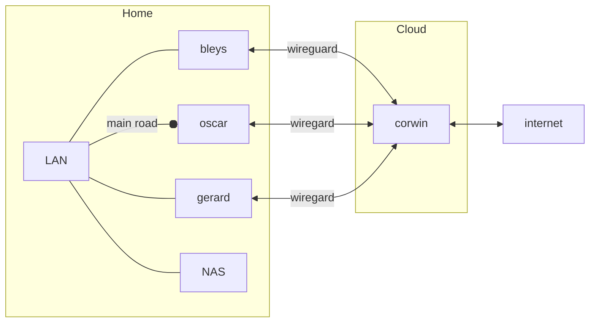

# Homelab

This repository contain my homelab Infrastructure As Code

this Homelab is build over Hashicorp software:

- Nomad
- Consul
- Vault

## Rebuild 
to rebuild from scratch ansible need a vault server up and unseal
you can rebuild a standalone vault server with a consul database snaphot with

```
make vault-dev FILE=./yourconsulsnaphot.snap
```


## Architecture


