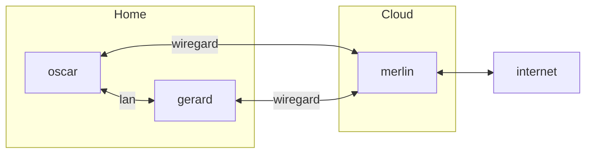

# Homelab


## Rebuild 
to rebuild from scratch ansible need a vault server up and unseal
you can rebuild a standalone vault server with a consul database snaphot with

```
make vault-dev FILE=./yourconsulsnaphot.snap
```


## Architecture


