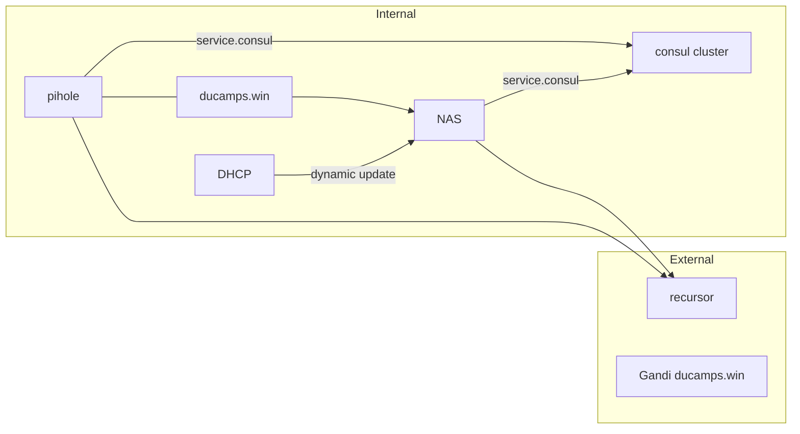

# Architecture DNS

## Detail

Pihole container in nomad cluster is set as primary DNS as add blocker secondary DNS is locate on NAS

DNS locate on NAS manage domain *ducamps.win* on local network pihole forward each request on *ducamps.win* to this DNS.

Each DNS forward *service.consul* request to the consul cluster. On Pihole a template configure each consul server.

On diskstation every request as forward to one consul node this point is to improve we because we have a possibility of outtage. du to synology DNSServer limitation we only put a forward on port 53 so we need on the target consul node to redirect port 53 to 8300 by iptables rules.

a DHCP service is set to do dynamic update on NAS DNS on lease delivery

external recursor are on cloudflare and FDN
