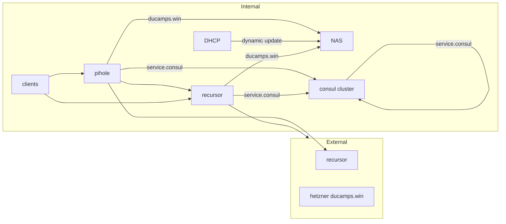

# Architecture DNS

## Detail

Pihole container in nomad cluster is set as primary DNS as add blocker secondary DNS recursore is locate on gerard

DNS locate on NAS manage domain *ducamps.win* on local network each recursor forward each request on *ducamps.win* to this DNS.

Each DNS forward *service.consul* request to the consul cluster. 
Each consul node have a consul redirection in systemd-resolved to theire own consul client

a DHCP service is set to do dynamic update on NAS DNS on lease delivery

external recursor are set on pihole on cloudflare and FDN in case of recursors faillure
